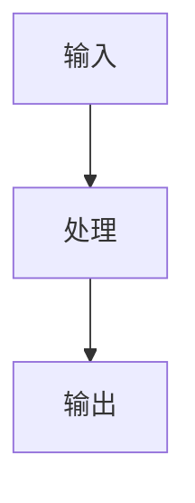

# Workflow Diagram

## Purpose

Use this skill to add a Mermaid flowchart to generated Markdown outputs.

## Instructions

1. Identify the workflow, decision path, CI pipeline, or iteration loop described by the source.
2. Generate a Mermaid fenced code block using `graph TD` or `flowchart TD`.
3. Keep node labels short and readable.
4. Include only source-supported steps. If the source has no explicit workflow, show a high-level inferred processing flow and mark uncertain details as `原文未明确`.
5. Do not include secrets or credentials in diagram labels.

## Expected Output

~~~markdown
## 流程图

~~~
